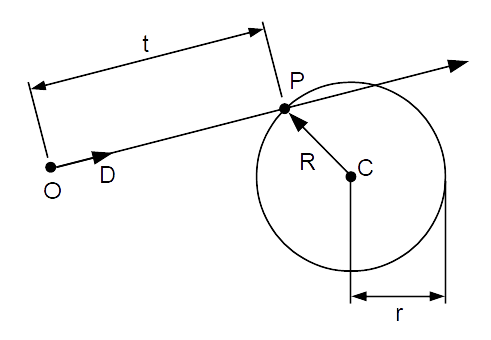

Ray Sphere Intersection
=======================

This is largely a re-hashing of https://raytracing.github.io/books/RayTracingInOneWeekend.html#addingasphere/ray-sphereintersection.

To check if a ray intersects a sphere we need:

 - A ray with an origin :math:`O`, a normalised direction vector
   :math:`\vec{D}` which we multiply with a scalar :math:`t` to arrive at points
   along the ray.
 - A sphere with a centre point :math:`C` and a radius :math:`r`.

We call the intersection point :math:`P`

Focusing on the sphere first, we can determine if :math:`P` is on the surface of
the sphere if the distance from :math:`P` to :math:`C` is equal to :math:`r`.

To find the distance we can consider a vector :math:`\vec{R}` that takes us
from :math:`C` to :math:`P`, and find it's length. :math:`\vec{R} = P - C` - 
that is - to travel from :math:`C` to :math:`P` we first go from :math:`C`
to the origin (:math:`- C`), then from the origin to :math:`P` (:math:`+ P`)
- the terms are then re-arragend to make things look a little nicer.

To find the length of a vector, the dot product of the vector with itself gives
the length squared. So if :math:`\vec{R} \odot \vec{R} = r^2` then :math:`P`
is on the surface of the sphere. Expanding this out this gives us:

.. math::

    (P - C) \odot (P - C) = r^2

To focus on the ray next, we say a point :math:`P` on the ray is given by the
origin of the ray :math:`O` plus the normalised direction vector :math:`\vec{D}`
multiplied by a scalar :math:`t`:

.. math::

    P = O + t\vec{D}

To find when a point on the ray is a point on the sphere we can plug in the
above to the definition of a point on a sphere, giving us:

.. math::
    
    (O + t\vec{D} - C) \odot (O + t\vec{D} - C) = r^2

Expanding out this dot product gives us:

.. math::

    O &\odot (O + t\vec{D} - C)

    +t\vec{D} &\odot (O + t\vec{D} - C)

    -C &\odot (O + t\vec{D} - C) = r^2

Expanding again:

.. math::

    O \odot O &+ t(\vec{D} \odot O) - C \odot O

    + t(\vec{D} \odot O) &+ t^2(\vec{D} \odot \vec{D}) - t(C \odot \vec{D})

    - C \odot O &- t(C \odot \vec{D}) + C \odot C = r^2

Collecting like terms gives us:

.. math::

    O \odot O + 2t(\vec{D} \odot O) - 2(C \odot O) + t^2(\vec{D} \odot \vec{D}) - 2t(C \odot \vec{D}) + C \odot C = r^2

Re-arranging a little:

.. math::

    2t(\vec{D} \odot O) + t^2(\vec{D} \odot \vec{D}) - 2t(C \odot \vec{D}) +  O \odot O - 2(C \odot O) + C \odot C = r^2

Looking at the last 3 terms, and knowing that:

.. math::

    (O - C) \odot (O - C) = O \odot O - 2(C \odot O) + C \odot C

We can simplify this to:

.. math::

    2t(\vec{D} \odot O) + t^2(\vec{D} \odot \vec{D}) - 2t(C \odot \vec{D}) + (O - C) \odot (O - C) = r^2

:math:`O - C` is the vector that takes you from the centre of the sphere
(:math:`C`) to the origin of the ray (:math:`O`) - or :math:`\vec{CO}`.

Re-arragning a little, and using :math:`\vec{CO}`:

.. math::

    t^2(\vec{D} \odot \vec{D}) + 2t(\vec{D} \odot O) - 2t(C \odot \vec{D}) + \vec{CO} \odot \vec{CO} = r^2

Pulling out :math:`2t\vec{D}` as a common factor gives us:

.. math::

    t^2(\vec{D} \odot \vec{D}) &+ 2t\vec{D} \odot (O - C) + \vec{CO} \odot \vec{CO} = r^2

    t^2(\vec{D} \odot \vec{D}) &+ 2t(\vec{D} \odot \vec{CO}) + \vec{CO} \odot \vec{CO} = r^2

Re arrange again to equal zero and we have a quadratic in terms of t!

.. math::

    t^2(\vec{D} \odot \vec{D}) + 2t(\vec{D} \odot \vec{CO}) + \vec{CO} \odot \vec{CO} - r^2 = 0

Where:

.. math::

    a &= \vec{D} \odot \vec{D}

    b &= 2(\vec{D} \odot \vec{CO})

    c &= \vec{CO} \odot \vec{CO} - r^2

Using the quadratic equation:

.. math::

    x=\frac{-b\pm\sqrt{b^2-4ac}}{2a}

This allows us to solve for :math:`t` - or positions along the ray.

Note that :math:`b` has a factor of 2 in it, so if we consider that
:math:`b = 2h` we can factor out the 2 and simplify the calculation a bit:

.. math::

    \frac{-b\pm\sqrt{b^2-4ac}}{2a}

.. math::

    \frac{-2h\pm\sqrt{(2h)^2-4ac}}{2a}

.. math::

    \frac{-2h\pm\sqrt{4h^2-4ac}}{2a}

.. math::

    \frac{-2h\pm2\sqrt{h^2-ac}}{2a}

.. math::

    \frac{-h\pm\sqrt{h^2-ac}}{a}

As :math:`\vec{D}` is normalised, and dotting something with itself
is the length squared, :math:`a` is 1 so it can be removed from
the last equation above.

.. math::

    -h\pm\sqrt{h^2-c}

Where:

.. math::

    h &= \vec{D} \odot \vec{CO}

    c &= \vec{CO} \odot \vec{CO} - r^2

If :math:`h^2-c` is less than 0 that means the square root
has no solutions and there is no intersection. If it's greater than 0, the
square root can be found and two :math:`t` values determined, which can be
plugged back into the ray equation to give the two intersection points of the
ray and the sphere.

Note that the values of :math:`t` may be negative - meaning an intersection
"behind" the ray. These negative t values can be screened out during the
intersection detection process.